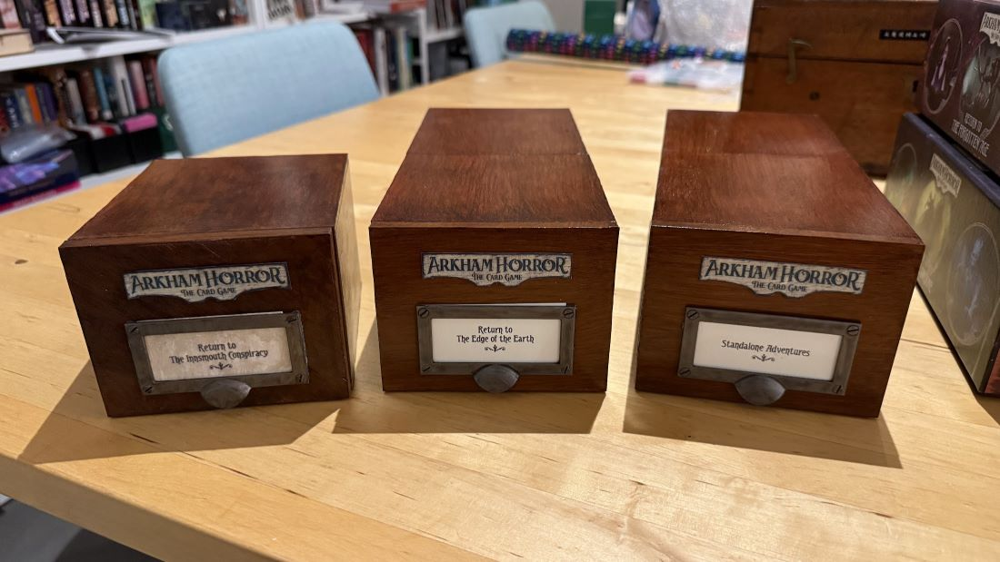

# 3D Printable Arkham LCG Card Boxes

These card boxes have been modelled after the "Return To" expansion boxes published for the Arkham Horror Living Card Game. Fantasy Flight stopped publishing these boxes a few campaigns back, so you can use these to complete your collection :-)

They should be an exact match to the size of the original boxes, and if painted just right they look great alongside them on a shelf.

In this repository you will find a few different versions of the STL files:

- 170mm length - a shorter version that can be printed on a Bambu A1 Mini
- 200mm length - a shorter version that can be printed on a Prusa MK3/4
- 240mm length - a shorter version that can be printed on a Bambu A1
- 296mm length - the full length version that will need an oversized print bed (e.g. Prusa XL)
- 296mm length split - the full length version split for printing on any printer

You will also find a source directory with my Fusion 360 working files. These files are fully parameterised, so you can tweak the box dimensions to your liking.

## Printing Tips

I used the following print settings with good results:

- Elegoo Black PLA+
- 0.2mm layer height (0.1mm for the door pull)
- Brim enabled
- 15% infill

It's worth noting that many of the pieces have large flat surfaces on the print bed with sharp corners. That's often a recipe for warping and curling! Make sure you have your first layer dialled in and very good print adhesion. A nice wide brim also helps.

The only piece that will require supports is the door pull, which just needs them enabled on the print bed only.

## Assembly Tips

Assembly should be fairly self-explanatory, but I've included a set of instructions just for fun. You can find it in assembly_instructions.pdf.

- Assembly definitely requires glue! Two part epoxy is ideal, but superglue will do in a pinch. I strongly recommend epoxy if building the split version, as the two halves of the tray and shell need a strong bond with not a lot of mating surface.
- Make sure that any glue "squeeze out" is cleaned up, especially on the inside of the shell. Globules of glue inside the shell can interfere with movement of the card tray.
- Don't worry too much about sanding, smoothing and worrying about small imperfections. If you paint these boxes it'll just make them look more weathered and authentic.

## Painting

These look fantastic when painted with a fake wood finish! I more or less followed [this guide](https://youtu.be/5NBW7uJnJGo) on YouTube, substituting whatever paints and washes I had on hand. My exact recipe was:

- Primer: Septone Automotive Plastic Filler Primer
- Base Coat: Liquitex Raw Sienna Spray
- Wash 1: Vallejo Mecha Dark Rust Wash
- Wash 2: Citadel Reikland Fleshshade
- Wash 3: Citadel Agrax Earthshade
- Wash 4: Citadel Nuln Oil
- Varnish: Vallejo Mecha Gloss Varnish (two coats)

For the door pull:

- Primer: Septone Automative Plastic Filler Primer
- Base Coat: Citadel Leadbelcher
- Wash: Citadel Nuln Oil

If I make more of these I'll probably look for some cheaper alternatives, as it uses up a lot of wash! I recommend using a hair dryer to make the painting process go quicker.

I experimented with using wood putty to smooth out the seam on the split version, but ultimately preferred the results without. You will always see small amount of deviation at the join due to minor warping of the pieces, so the seam looks a little more natural.

## Finishing Touches

- For the Arkham logos, I just printed them out onto cardstock, carefully cut them out using a craft knife and gave it a little brush of gloss varnish to counter the "inkjet" look.
- The font for the insert is called "Teutonic" and can be found [here](https://www.dafont.com/teutonic2.font)
- When cutting out the insert, make sure you keep it just a little bit taller than the holder - this gives you something to grab when you want to change it out.
- You can weather the insert with a little bit of leftover wash (e.g. Nuln Oil) 

## License

CC-BY

https://creativecommons.org/licenses/by/4.0/